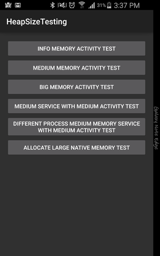

# Android Heap Allocation zero-to-one
Have you ever considered how much memory Android VM allow to allocate for your application? If answer is yes, how can you overcome this limitation ? This blog post will explain in detail about those things.


# Heap memory allocated limitation.

We come to one basic question: how much memory will Android allow for one application. Luckily we have a way for knowing this.

### Helper method:
Android provides one method for developer knowing this. This method is useful so we can take care about maximum memory when application is running. We also reuse this method for other examples in this topic.

```java
public int getAllowAllocatedMemory() {
    ActivityManager am = (ActivityManager)  getSystemService(ACTIVITY_SERVICE);
    // unit return from system is megabyte.
    int realAllowMemory = am.getMemoryClass();
    // we convert back to byte
    return realAllowMemory * 1000 * 1000;
}
```

Maximum allowable memory depends on screen size, screen density and especially by manufacturer. Galaxy Note Edge will return 256 MB but Google Nexus 5 will return 512 MB. Other useful methods such as total memory, avaiable memory … can be referenced in **HeapTestApplication.java**. We can also get directly this value by running this command:

```shell
adb shell getprop dalvik.vm.heapgrowthlimit
```

## Testing
We will test our assumption on two test cases. First test will always raise **OutOfMemory Exception** when we allocate too much memory. Second test allocate slightly less memory will not throw exception.
First test’s code snippet:

```java
try {
    byte[] bigData = new byte[getAllowAllocatedMemory()];
} catch (OutOfMemoryError e) {
    Log.e("Error", "OutOfMemory Exception");
}
```

We will see this piece of code always throws **OutOfMemory Exception**. Noting that because application when starting has consumed a little memory, so although allocating memory is not overcome allowable memory, we still meet exception. Reader can learn more detail in **BigControllerActivity.java** in project.

Secondly. We allocate slightly smaller memory:

```java
byte[] mediumData = new byte[getAllowAllocatedMemory() / 10 * 9];
```

No exception throw as we guess. You can see detail this test in **MediumActivity.java** in repository.

# 2. Android limits memory per process.
We often think Android limits memory per application. In fact, Android limits memory per process. For improving memory allocation for application, android developer often apply this trick by creating multi process components. Components with different processes must communicate through IPC mechanism.

We verify our assumption by using two tests.

First test: We try to create two instances: one instance is activity and one instance is service. Each instance will be allocated with medium memory data. Although each instance’s memory doesn’t exceed allowable application heap memory but total memory consumed by service and activity instance violates this constraint.
As usual, we define service in manifest file.

```xml
<service
    android:name="MediumService"
    android:enabled="true"
    android:exported="true" />
```

And we allocate memory in **onStartCommand** method. Reader can study detail in **ServiceController.java**

```java
@Override
public int onStartCommand(Intent intent, int flags, int startId) {
  byte[] data = new byte[getAllowAllocatedMemory() / 10 * 9];
    return START_STICKY;
}
```

On second test. We just create service on different process by declaring on manifest file:
```xml
<service
    android:name="DifferentProcessService"
    android:enabled="true"
    android:exported="true"
    android:isolatedProcess="true" />
```

Now, we can start both activity and service without **OutOfMemory** exception. Reader can study detail in **DiffProcessControllerActivity.java**

# 3. Native Heap
Before deeping into native heap, we will have a short tour about all types of android heap. Android has 3 type of heaps:

- **Java heap**: All objects created using the Java language’s **new** operator go here. This is a relatively safe area of memory to use. Memory is garbage-collected, so when the app has finished with memory, the system will automatically reclaim it.
- **Native heap**: used by the C++ **new** operator. There is much more memory available here. The app is limited only by the physical memory available on the device. There is no garbage collection and nothing to slow things down. However, C++ programs are responsible for freeing every byte of memory they allocate, or they will leak memory and eventually crash.
- **Ashmem**: short term for **Android Shared Memory**. This operates much like the native heap but has additional system calls. Android can “unpin” the memory rather than freeing it. This is a lazy free; the memory is freed only if the system actually needs more memory. When Android “pins” the memory back, old data will still be there if it hasn’t been freed.

Very special property of native heap is it can be allocated as much as you can unless it’s less than total available memory from system.

For testing our assumption, we define 2 native interfaces for calling C++ code under native layer. First method is used for allocating memory and second method is used for freeing memory after done with object.
```java
public native Object getBigDataFromJni(int memory);

public native void deallocateData(Object object);
```

Then we implement two method using C language. Developer should remember that we must call **malloc** function. **Malloc** will create memory in native layer. In contrast, **NewByteArray** will call memory allocation from java so it still be limited by heap size constraint. Code demo is presented in **jni/large-memory-jni.c**

```c
JNIEXPORT jobject JNICALL
Java_memory_getBigDataFromJni(JNIEnv *env, jobject instance, jint memory) {

     // allocate memory at native layer using Java layer. Still meet restriction about memory
     // jbyteArray ret = (*env)->NewByteArray(env, memory);

     unsigned char* buffer = (unsigned char*) malloc(memory);
     jobject directBuffer = (*env)->NewDirectByteBuffer(env, buffer, memory);
     return directBuffer;
}

JNIEXPORT void JNICALL
Java_memory_deallocateData(JNIEnv *env, jobject instance, jobject directBuffer) {

    unsigned char* buffer;
    buffer = (unsigned char*) (*env)->GetDirectBufferAddress(env, directBuffer);
    free(buffer);
}
```

Then from our java code, we create an object by calling native method:
```java
final ByteBuffer data = (ByteBuffer) getBigDataFromJni(getAllowAllocatedMemory());
// dataSize should equal to allocated size.
int dataSize = data.remaining() / (1000 * 1000);
```

In future, when we done with this object, we must free by hand:
```java
deallocateData(data);
```
Reader can read carefully about this method by reading **JNIActivity.java**

Last but not least, there is a hack way for allocating large heap memory by setting attribute **largeHeap** to **true** in manifest file.
```xml
<application
        android:icon="@drawable/ic_launcher"
        android:largeHeap="true">
</application>
```

This is a very hacky way and developer should avoid using this except some specific purpose.

Finally, we have finished our great tour how android manage heap section and methods for improving memory usage. By using in true way, android application not only improve heap size capacity but also prevent Android VM kill application for another active applications when system in low memory state.

Here is a GUI for application demonstrate all above examples. Hope you enjoy ^^



# Reference Link
- <a href="http://stackoverflow.com/questions/2630158/detect-application-heap-size-in-android">Detect application heap size in Android</a>
- <a href="https://developer.android.com/training/articles/memory.html">Managed app memory</a>
- <a href="http://stackoverflow.com/questions/5350465/android-heap-size-on-different-phones-devices-and-os-versions">Android Heap Size on Phone</a>